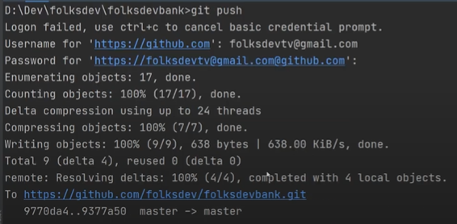
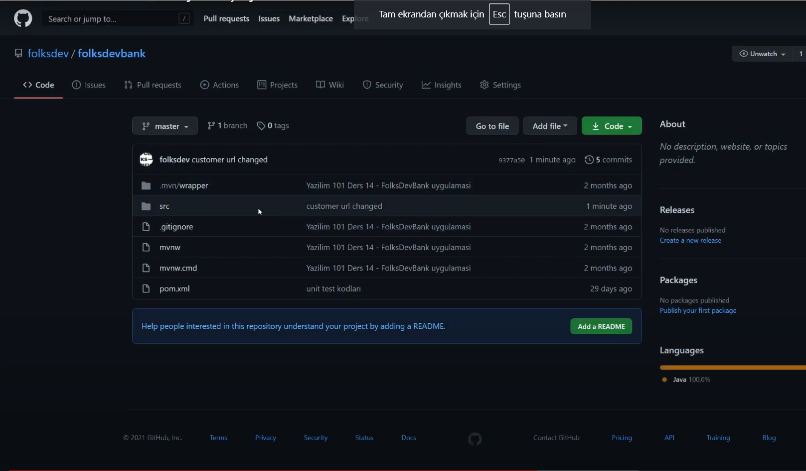
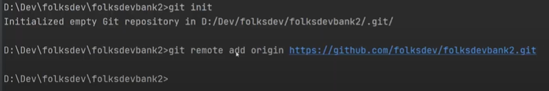
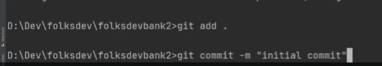
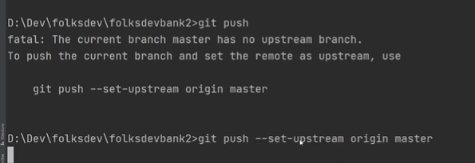
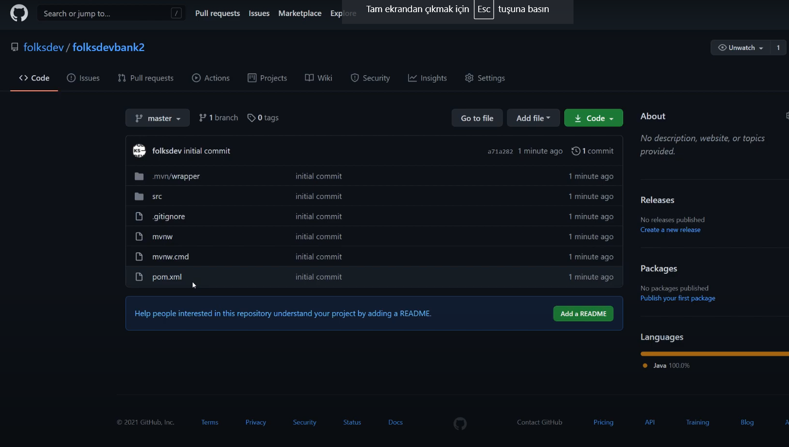

```{r setup, include=FALSE}
knitr::opts_chunk$set(echo = TRUE)
```


<div align="center"> 
</div>

       
  

<a href="https://www.erbakan.edu.tr/"> </a> 

### <font color="red">1. GitHub Nedir? </font>

<p>GitHub, Git adlı bir sürüm kontrol sistemini (VCS) barındıran bulut tabanlı bir proje yönetimi ve organizasyon platformudur. Yani, tüm GitHub kullanıcıları, kendilerine sunulan diğer Git işlevlerine aynı yerden erişirken, kaynak kodda yapılan değişiklikleri gerçek zamanlı olarak izleyebilir ve yönetebilir.
Dahası, GitHub’ın kullanıcı arayüzü Git’ten daha kullanıcı dostudur ve çok az teknik bilgiye sahip olan veya hiç olmayan kişiler için erişilebilir hale getirir. Ek olarak, birçok işveren GitHub kullanmaktadır. Dolayısıyla, bir iş bulmayı planlıyorsanız, GitHub’da yolunuzu zaten biliyorsanız, gerçekten iyi görüneceksiniz.  </P> 

```{r, eval=FALSE}
getwd()
```


### <font color="red">2. Sürüm Kontrolü Nedir? (Version Control) </font>

<p>Sürüm kontrolü, bir dosyada veya bir dizi dosyada yapılan değişiklikleri izlemeye ve yönetmeye yardımcı olan bir sistemdir.</P>

<p>Ağırlıklı olarak yazılım mühendisleri tarafından kaynak kodunda yapılan değişiklikleri izlemek için kullanılan sürüm kontrol sistemi, tüm değişiklikleri analiz etmelerini ve bir hata yapıldığında herhangi bir sonuç olmadan geri almalarını sağlar.Başka bir deyişle, sürüm kontrolü, geliştiricilerin **aynı anda** projeler üzerinde çalışmasına olanak tanır. </P>

<p>Kaynak kodunda söz konusu değişiklikler, dağıtıldıklarında projeyi bozarsa, GitHub bunları birkaç tıklamayla tersine çevirmeyi kolaylaştırır ve projenin önceki sürümü geri getirilir. </P>


### <font color="red">3. Git Nedir? </font>

<p>Git, 2005 yılında başlatılan ve piyasadaki en popüler VCS’lerden biri haline gelen açık kaynaklı bir projedir. Geliştiricilerin çoğu projeleri için Git’i kullanır. </P>
<p>Erişim izni verilen ekipteki herhangi bir geliştirici, Git komut satırı araçlarını kullanarak kaynak kodunu ve değişiklik geçmişini yönetebilir.
Git,  merkezi sürüm kontrol sistemlerinden farklı olarak özellik dalları (feature branches) sunar. Bu, ekipteki her yazılım mühendisinin kodda değişiklik yapmak için yalıtılmış bir yerel depo sağlayan bir özellik dalını ayırabileceği anlamına gelir.
Özellik dalları, orijinal proje kodunun bulunduğu ana dalı etkilemez. Değişiklikler yapıldıktan sonra, özellik dalı ana dal ile birleştirilebilir, bu şekilde projede yapılan değişiklikler etkin hale gelir. </P>

### <font color="red">4. Hub nedir?</font>
GitHub’daki hub, komut satırını, geliştiriciler için en büyük sosyal ağa çevirme amaçlı oluşturulmuştur.
Belirli bir projeye katkı sağlamanın dışında GitHub kullanıcılarına kendileri gibi hemfikir insanlarla sosyalleşme olanağı sağlar. İnsanları takip edebilir ve ne yaptıklarını veya kimle bağlantı kurduklarını izleyebilirsiniz.

#### <font color="red">GitHub Nasıl Kullanılır? </font>
GitHub’ı ücretsiz olarak deneyebilirsiniz. Sınırsız depo ve ortak çalışan ancak yalnızca 500 MB depolama alanı içeren temel bir plan mevcuttur.

Gerekli bilgileri doldurduktan ve kayıt işlemini bitirdikten sonra GitHub'ı keşfetmeye başlayabilirsiniz. Git’ten farklı olarak GitHub, komut satırının kodlanmasını veya kullanılmasını gerektirmez.

#### <font color="blue">Buradaki işlemler 2 şekilde yapılabilir: </font>
1. GitHub üzerinden
2. Git üzerinden

Git üzerinden nasıl yapıldığına bir bakalım:

## <font color="green">Temel kavramlar</font>

#### <font color="red">GitHub Reposu (Deposu) Oluşturun </font>

##### <font >**Repository (Repo) (Depo)** </font>
Repository veya repo, projelerinizin dosyalarının depolandığı bir dizindir. GitHub’ın alanında veya bilgisayarınızdaki yerel bir depoda bulunabilir. Dosyalar, fotoğraflar, sesler veya projenize alakalı her şeyi repository’inizde depolayabilirsiniz.


##### <font >**Branch** </font>
Projeyi bir doğru şeklinde düşünelim, ana gövde oluşturduktan sonra, çalışmanın herhangi bir yerinde bir branch (dal, şube) oluşturabilir ve çalışmanızın o noktadan sonraki kısmını siz veya başkasının o branch üzerinden yürütmesini sağlayabilirsiniz.

##### <font >**Clone** </font>
kopyalamak, klonlamak, projeyi bilgisayara indirmek gibi anlamlara gelir.

##### <font >**Commit Changes** </font>
Repo’da bulunan bir değişikliğin kaydedilmesi demektir.

##### <font >**Pull Request (PR)** </font>
Bir alanda yapılan değişikliğin başka bir alanla birleştirilmesi isteğidir.


##### <font >**Belli Başlı Git Komutları** </font>
Git uygulamasını bilgisayarınıza kurduysanız GitHub’a girmeden de bazı işlemler yapabilirsiniz.

#### <font color="blue">Git kullanmaya nasıl başlayabiliriz? </font>
iki farklı senaryo ile kullanıma başlayabiliriz. 
<font color="orange">Birinci senaryo, uzak sunucudaki bir projeyi kendi bilgisayarımıza indirmek; ikincisi ise kendi bilgisayarımızdaki bir projeyi uzak sunucuya göndermek </font>  şeklinde açıklanabilir. Bu senaryoları aşağıda uygulamalı olarak gösterelim:

<font color="brown">Birinci senaryo için </font>öncelikle indirmek istediğimiz projenin olduğu github sayfasına gelip, "code" sekmesinden, aynı isimli butona tıklayıp url yi kopyalıyoruz.


<p>CMD ekranına:</p>

1.
```{r, eval=FALSE}
git --version
```

<p>komutunu yazdıktan sonra, Git programı sorunsuzca yüklendiyse, versiyonu görülebilmektedir.</p>


2. 
```{r, eval=FALSE}
git config
```
<p>komutu bilgisayarınızdaki git terminalinin kendi GitHub hesabınıza bağlayan konfigürasyon işlemini gerçekleştirir.</p>

```{r, eval=FALSE}
git config --global user.name “kullanıcı adınız”

git config --global user.email “kullanıcı e-mail adresiniz”
```

Bu iki komut girildikten sonra, Git terminaliyle yapacağınız işlemler artık GitHub hesabınızda da değişikliğe neden olacaktır.</p>


3.
```{r, eval=FALSE}
git clone
``` 

<p>yazıp, kopyaladığımız url yi yapıştırdıktan sonra istenen proje (repo), bilgisayara ve belirtilen dizine indirilmiş (klonlanmış) olacaktır. Url deki github.com’dan sonraki kısım ise hangi “kullanıcı adı” isimli kullanıcıdan dosyanın klonlandığını gösterir.</p>

<p>(ve dosyada değişiklik yapıp kaydettikten sonra, CMD ekranında cd "klonlanan_dosya_adi" nı yazıp bu dizine ilerliyoruz.)</p>


4.
```{r, eval=FALSE}
git status
```  

<p>Bu komut, repository'nin mevcut durumunu gösterir.Projede değişiklik yapılmış ise, bu değişiklikler görüntülenebilir.</p>


5.
```{r, eval=FALSE}
git add .
```

<p>Bu komut değişen tüm dosyaları GitHub'a göndermek üzere hazırlar (staging). En sondaki nokta, tüm dosyaları ifade eder. Buraya nokta yerine dosya veya klasör ismi de yazılabilmektedir.</p>


6.
```{r, eval=FALSE}
git commit -m "commit mesaji"
``` 

Bu komut ile, bir önceki aşamada hazırlanan değişiklikler, bir mesaj ile birlikte yereldeki (localhost) repository'e kaydedilir. Mesaj kısmı, projede yapılan değişiklikleri açıklayıcı olmalıdır.

(Ör: git commit -m "Header'daki yazım hatası giderildi.")


7. 
```{r, eval=FALSE}
git push
```

uzaktaki sunucuda değişiklikleri kaydetmek için bu komut kullanılır.

```{r, echo=FALSE}

```

<p>NOT: token oluşturulmadığı için hata mesajı gelebilir. Çözümü için <https://www.youtube.com/watch?v=QOIXeNs9I7o></p>


8. 
```{r, eval=FALSE}
git config -l
```

<p>kullanıcı adı, kullanıcı epostası gibi birçok bilgi, bu komutla edinilebilir.</p>

Ve artık GitHub üzerinde düzenlenen projemizi eşzamanlı görebiliyoruz:

```{r, echo=FALSE}

```


<font color="brown">yeni repository oluşturup 2. senaryoyu görelim: </font>

1. GitHub' ta hesabım->your Repositories tıklayıp "New" butonuna basıp "Repository name" satırına bir isim girelim, altta "creating repository" tıklayalım. Şuanda boş bir repo oluşturduk hesabımızda. Şimdi de bilgisayarımızda bulunan projeyi bu repoya aktaralım...


2. Sitede, repository sekmesinde, "code" içinde hazır kodlar bulunmakta. Adım adım uygulayalım.Öncelikle CMD ekranında "cd .." yazarak bir üst dizine çıkalım.
```{r, eval=FALSE}
git init
```
komutunu uygulayalım.


3.Sitedeki
```{r, eval=FALSE}
git remote add origin https://github.com/Feyzanurozdemir/DenemeArtik.git
```
<p>komutunu kopyalayıp yapıştıralım.</p>
```{r, echo=FALSE}

```

4. 
```{r, eval=FALSE}
git status
```

```{r, eval=FALSE}
git add .
```
<p>diyerek kontrol ediyoruz ve yaptığımız değişiklikleri ekliyoruz. </p>

```{r, eval=FALSE}
git commit -m "commit mesaji"
```
<p>dedik ve mesajımızı giriyoruz:</p>
```{r, echo=FALSE}

```


```{r, eval=FALSE}
git push
```
<p> denildikten sonra ilk kez girileceği için ekran resmideki kod yazılır ve açılan pencerede GitHub hesap maili ve parola girilir:</p>
```{r, echo=FALSE}

```


<p>Artık, bilgisayarımızda olan projeye ait tüm dosyaları, uzak sunucuya yollamış olduk...</p>

```{r, echo=FALSE}

```


<p>Artık GitHub'ı, Git ile kullanıp projelerimizi düzenleyebileceğiz...</p>
<br>
</br>


        


